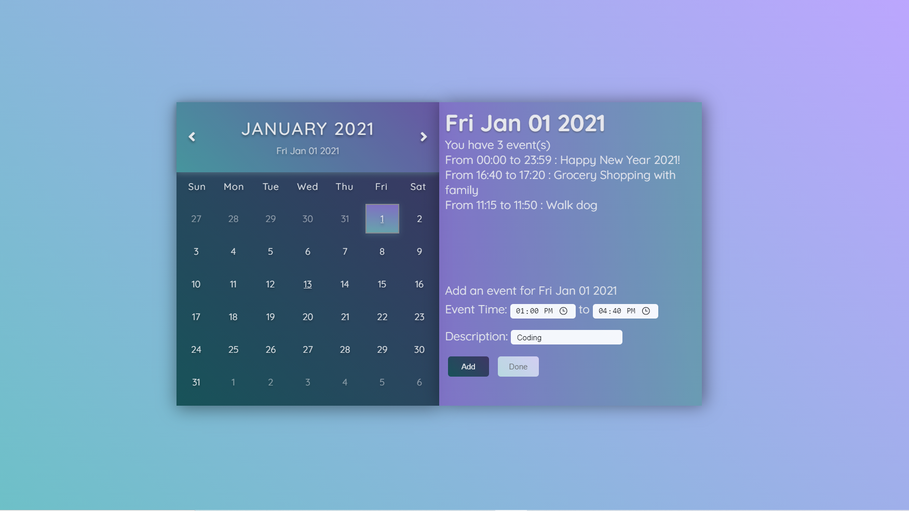
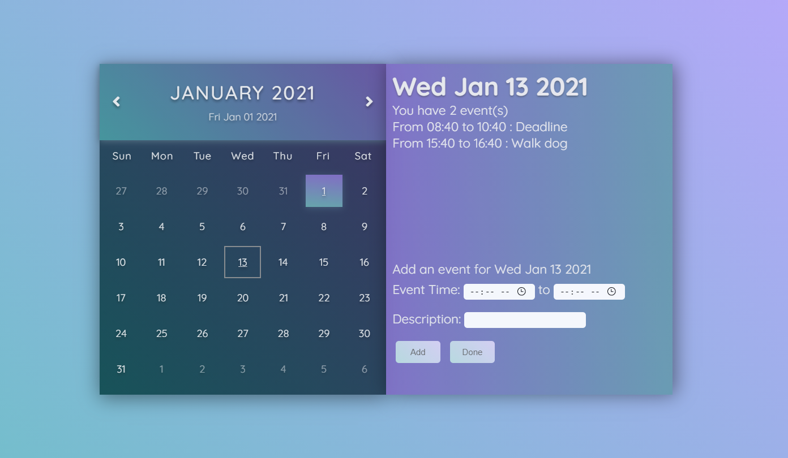

# Dynamic-Calendar
	Year, month, weekdays and days are displayed dynamically
	Today's date is highlighted
	Previous-month days and next-months days are greyed out
	< previous month, next month >

# Dynamic-Scheduler
	Add Event(s), Store Events(s), and View Event(s) for each day
	"Done" to hide the adding-event form
	Underline the days that have at least one event as a reminder

# File include:
	index.html
	main.css
	main.js
https://addiexx1.github.io/Dynamic-Calendar/

	

